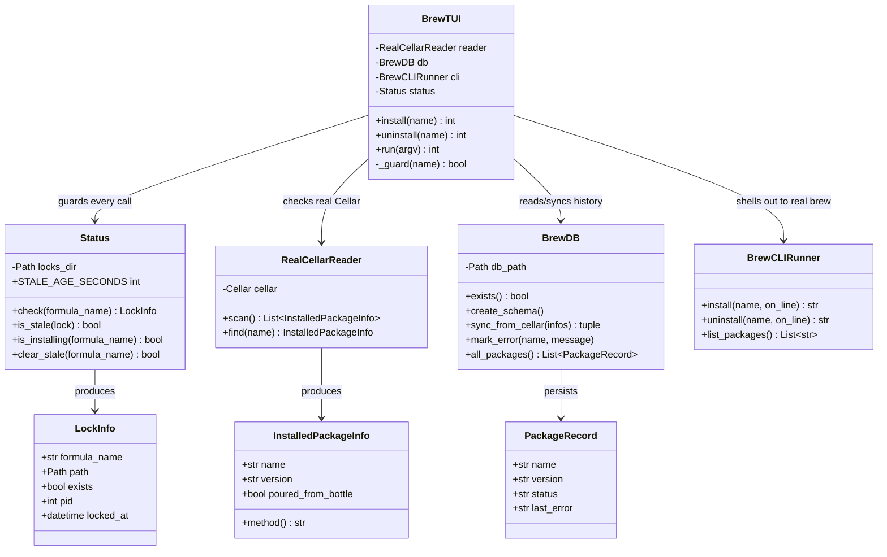
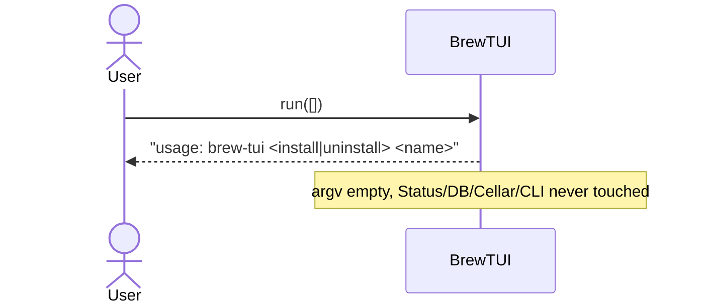
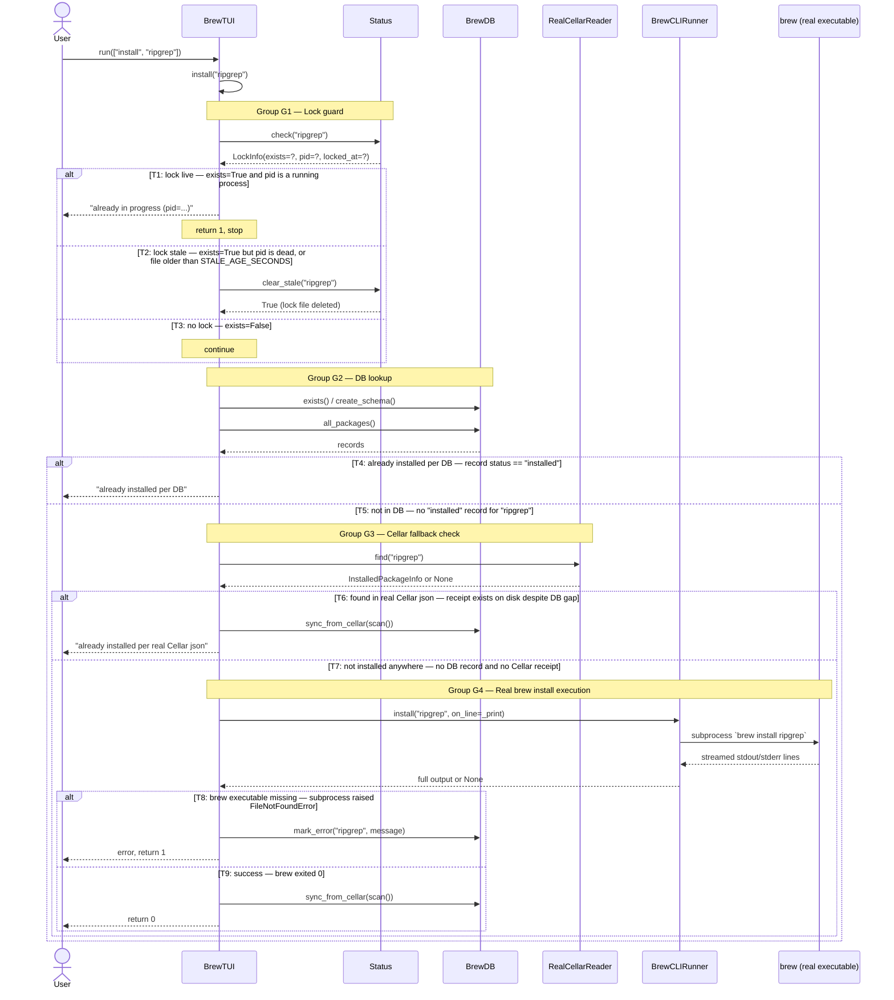
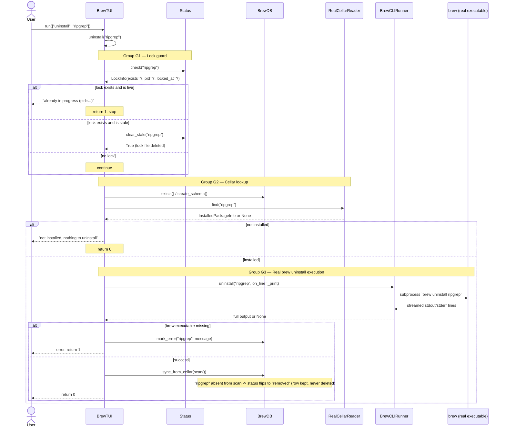

# `brew-tui` — UML Flow Diagrams

Diagrams below are standard UML (sequence + class) expressed in Mermaid syntax.

> As of 0.0.17, `brew-tui` (no args) launches `BrewTUIApp`, a full-screen interactive
> front-end built on [Textual](https://textual.textualize.io/). `BrewTUIApp` is a thin
> widget layer (package table, formula input, Install/Uninstall/Refresh buttons, a
> live output log) that drives the `BrewTUI` class documented below — the business
> logic and its `Status`/`RealCellarReader`/`BrewDB`/`BrewCLIRunner` collaborators are
> unchanged. `BrewTUI().run(argv)` still works standalone for scripted/CI use
> (`brew-tui install <name>`, `uninstall <name>`, `list`).

## Class diagram — entities involved in install/uninstall

## Sequence diagram — `brew-tui` (no args)

## Sequence diagram — `brew-tui install ripgrep`

## Sequence diagram — `brew-tui uninstall ripgrep`

## Why `Status` sits in front of both commands

Homebrew itself takes a real lock file per formula while it installs/uninstalls/upgrades
(`Library/Homebrew/lock_file.rb`, one file per formula under
`$(brew --prefix)/var/homebrew/locks/`). If a previous `brew-tui` run — or a plain
`brew install` run in another terminal — died without cleaning up, that lock file can be
left behind ("stale"). `Status` is the single place that:

1. Locates the lock file for a given formula name.
2. Reads an optional PID out of it and checks with `os.kill(pid, 0)` whether the owning
   process is still alive.
3. Falls back to a file-age threshold (`STALE_AGE_SECONDS`, default 300s) when no PID is
   recorded.
4. Exposes `is_installing()` (true only for a live lock) and `clear_stale()` (deletes a
   confirmed-stale lock).

`BrewTUI._guard()` is the only caller of `Status` — every `install`/`uninstall` path goes
through it before touching `BrewDB`, `RealCellarReader`, or `BrewCLIRunner`, so a genuinely
in-progress operation can never be raced by a second `brew-tui` invocation.
